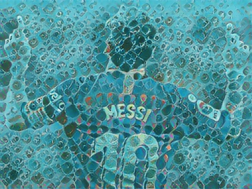

# Neural-Style-Transfer# Neural Style Transfer App

This repository contains a Streamlit-based web application for performing Neural Style Transfer using TensorFlow. The app allows users to upload a content image and a style image, and then generates a new image that combines the content of the content image with the style of the style image.

## Table of Contents
- [Overview](#overview)
- [Deployment](#deployment)
- [Video Demo](#video-demo)
- [Features](#features)
- [Installation](#installation)
- [Usage](#usage)
- [Model Details](#model-details)
- [Example Results](#example-results)
- [Conclusion](#conclusion)
- [Future Recommendations](#future-recommendations)
- [Acknowledgements](#acknowledgements)

## Overview

Neural Style Transfer (NST) is an optimization technique used to take two images—a content image and a style reference image (such as an artwork by a famous painter)—and blend them together so the output image looks like the content image, but painted in the style of the style image.

This application uses a pre-trained VGG19 model to extract content and style features, and then iteratively adjusts the content image to match the style features of the style image. The application is built using Streamlit, a Python library that makes it easy to create and share custom web apps for machine learning and data science.

## Deployment

You can access the deployed version of the app using the following link:

[Neural Style Transfer App](https://neural-style-transfer-charizard001.streamlit.app/)

## Video Demo

Watch the video demo to see the app in action:

[Watch the video](https://www.youtube.com/watch?v=ZNvfwTfchpM)


## Features

- **Upload a content image and a style image**: Easily upload images directly from your device.
- **Generate a stylized image**: Combine the content of the content image with the style of the style image using neural style transfer.
- **Display the stylized image**: View the resulting image directly within the web application.

## Installation

1. Clone the repository:

    ```bash
    git clone https://github.com/yourusername/neural-style-transfer-app.git
    cd neural-style-transfer-app
    ```

2. Install the required dependencies:

    ```bash
    pip install -r requirements.txt
    ```

3. Run the Streamlit application:

    ```bash
    streamlit run streamlit_app.py
    ```

## Usage

1. Open your web browser and go to `http://localhost:8501`.
2. Upload a content image and a style image using the file uploader.
3. Click the "Generate Stylized Image" button to perform neural style transfer.
4. The stylized image will be displayed on the page.

## Model Details

The neural style transfer model uses a pre-trained VGG19 network to extract features from the content and style images. It optimizes the generated image to match the content features of the content image and the style features of the style image. The optimization is done using gradient descent.

The model consists of the following key components:
- **`tensor_to_image`**: Converts a tensor to a PIL image.
- **`load_img`** and **`load_preprocess_img`**: Load and preprocess images.
- **`deprocess`**: Converts processed images back to their original form.
- **`vgg_layers`**: Extracts features from the VGG19 model.
- **`get_content_loss`**, **`gram_matrix`**, **`get_style_loss`**: Computes content and style losses.
- **`get_feature_representations`**: Extracts features from content and style images.
- **`compute_loss`**, **`compute_grads`**: Computes the total loss and gradients.
- **`run_style_transfer`**: Main function to perform style transfer.

## Example Results

Here are some examples of content images, style images, and the resulting stylized images:

### Stylized Image


### Stylized Image


### Stylized Image


### Stylized Image


### Stylized Image


## Conclusion

This project demonstrates the powerful capabilities of neural style transfer to blend artistic styles with photographic content. By leveraging the pre-trained VGG19 model and TensorFlow's optimization routines, the application can produce visually stunning results. The Streamlit interface makes it accessible and user-friendly, allowing anyone to experiment with neural style transfer.

## Future Recommendations

For future improvements and features, consider the following recommendations:
- **Adjustable parameters**: Allow users to adjust parameters such as content weight, style weight, and the number of iterations directly from the UI.
- **Multiple styles blending**: Enable blending of multiple style images with the content image.
- **Real-time processing**: Implement optimizations for faster processing and real-time previews.
- **Enhanced UI/UX**: Improve the user interface and experience with more interactive features and better error handling.
- **Deploy online**: Deploy the application on a cloud platform like Heroku or AWS to make it accessible to a wider audience.

## Acknowledgements

This project utilizes the following resources and libraries:
- [TensorFlow](https://www.tensorflow.org/)
- [Streamlit](https://www.streamlit.io/)
- [VGG19 model](https://keras.io/api/applications/vgg/)
